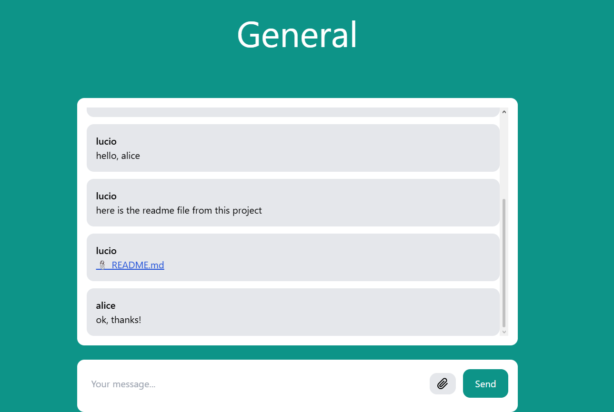

# Django Chat

Real-time chat rooms built with **Django** and **Django Channels**. Users sign up, join a room and exchange text messages and files instantly over **WebSockets**; the message history is stored in the database.

Originally built in 2023 as a university project for a Network Applications course, and refactored in 2026 (security fixes, file storage, automated tests, Docker setup).



## Features

- Sign up, log in and log out (Django authentication)
- Multiple chat rooms, managed from the Django admin
- Real-time text messages over WebSockets
- File sharing (up to 5 MB), downloadable only by logged-in users
- Last 50 messages loaded when entering a room
- Runs on SQLite out of the box, or PostgreSQL + Redis with Docker Compose

## Tech stack

| Layer | Technology |
| --- | --- |
| Backend | Python, Django 5.2, Django Channels 4, Daphne (ASGI) |
| Real-time | WebSockets, channel layer (in-memory or Redis) |
| Database | SQLite (default) or PostgreSQL |
| Frontend | Django templates, vanilla JavaScript, Tailwind CSS |
| Testing | pytest, pytest-django, Channels test utilities |
| Infrastructure | Docker, Docker Compose |

## How it works

```
Browser ──HTTP──▶ Django views (pages, login, file downloads)
   │
   └──WebSocket /ws/<room>/──▶ ChatConsumer ──▶ saves Message to the database
                                    │
                                    └──▶ channel layer group "chat_<room id>" ──▶ every browser in the room
```

1. When a user opens a room, the page connects to `/ws/<room-slug>/`.
2. `ChatConsumer` (`room/consumers.py`) rejects anonymous users and unknown rooms, then adds the connection to the room's group.
3. Each message is saved to the database and broadcast to the group, so all connected users receive it at once.
4. The author always comes from the authenticated session, never from data sent by the client.
5. Files are sent as base64 over the WebSocket, size-checked, stored on disk, and served through an authenticated download view.

## Running locally

Requires Python 3.11+.

```bash
python -m venv .venv
source .venv/bin/activate          # Windows: .venv\Scripts\activate
pip install -r requirements-dev.txt

python manage.py migrate           # also creates a "General" room
python manage.py createsuperuser   # optional, to manage rooms in /admin
python manage.py runserver
```

Open http://127.0.0.1:8000, create two accounts (e.g. in a normal and a private window) and chat between them.

## Running with Docker (PostgreSQL + Redis)

```bash
docker compose up --build
```

The app runs at http://localhost:8000, using PostgreSQL for data and Redis as the channel layer, which is what allows several server processes to share messages.

## Running the tests

```bash
pytest
```

The suite covers authentication, access control, the WebSocket consumer (broadcasting, room isolation, impersonation attempts, file uploads and size limits) and HTML escaping.

## Configuration

Settings are read from environment variables (see `.env.example`). With no variables set, the app runs in development mode with SQLite and an in-memory channel layer.

| Variable | Purpose |
| --- | --- |
| `DJANGO_SECRET_KEY` | Required when `DJANGO_DEBUG=0` |
| `DJANGO_DEBUG` | `1` (default) or `0` |
| `DJANGO_ALLOWED_HOSTS` | Comma-separated hosts |
| `REDIS_URL` | Use Redis as the channel layer |
| `POSTGRES_DB`, `POSTGRES_USER`, `POSTGRES_PASSWORD`, `POSTGRES_HOST`, `POSTGRES_PORT` | Use PostgreSQL instead of SQLite |

## Project structure

```
djangochat/   project settings, URL routing, ASGI entry point
core/         front page, sign-up and login
room/         rooms, messages, WebSocket consumer, file downloads
tests/        pytest suite
```

## Possible improvements

- Upload files over HTTP instead of base64 over the WebSocket, to support larger files
- Create rooms from the UI instead of the admin
- Show online users and typing indicators
- Production deployment setup (static files, HTTPS, media storage)
